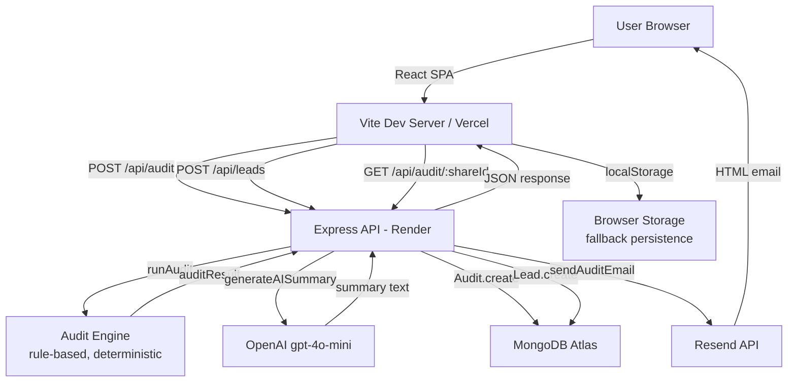

# Architecture — SpendPilot AI Audit

## System Diagram



## Request Flow — Audit Submission

```
1. User submits form  →  POST /api/audit
                              │
                    2. runAudit(tools, teamSize, useCase)
                              │
                    3. 20 rule checks against PRICING constants
                              │
                    4. generateAISummary(auditResult)
                         ├── OpenAI API (if key configured)
                         └── buildFallbackSummary() (deterministic)
                              │
                    5. Audit.create({ ...result, shareId: uuid })
                         └── MongoDB Atlas (non-blocking, non-fatal)
                              │
                    6. Return { summary, recommendations, flags, aiSummary, shareId }
                              │
                    7. Frontend saves to localStorage + navigates to /results
```

## Frontend Architecture

- **React 18 SPA** with React Router v6 for client-side routing
- **Tailwind CSS** (v4 via `@tailwindcss/vite`) for utility-first styling
- **Framer Motion** for page and card animations
- **Recharts** for spend distribution pie chart and current vs optimized bar chart
- **react-hot-toast** for non-intrusive notifications
- **Axios** instance (`services/api.js`) with `VITE_API_URL` env var for environment switching
- **localStorage** for form persistence across reloads and fallback audit result storage

### Page structure

| Route | Component | Purpose |
|-------|-----------|---------|
| `/` | LandingPage | Marketing page with hero, features, FAQ, CTA |
| `/audit` | AuditFormPage | Dynamic multi-row audit form |
| `/results` | ResultsPage | Savings dashboard, charts, AI summary, lead capture |
| `/share/:id` | SharePage | Public-safe report view (no PII) |

## Backend Architecture

- **Express 5** REST API with MVC pattern
- **Mongoose** ODM for MongoDB schema enforcement and query building
- **dotenv** for environment-based configuration
- **uuid v4** for share IDs (decoupled from MongoDB ObjectIDs)

### MVC layers

```
routes/          →  URL mapping + HTTP method binding
controllers/     →  Request validation, orchestration, response shaping
services/        →  Business logic (audit engine, AI summary, email)
models/          →  Mongoose schemas (Audit, Lead)
```

### API endpoints

| Method | Path | Description |
|--------|------|-------------|
| POST | `/api/audit` | Run audit, save to DB, return results + shareId |
| GET | `/api/audit/:shareId` | Fetch public-safe audit by share ID |
| POST | `/api/leads` | Save lead, send email via Resend |

## Audit Engine Design

The engine (`services/auditEngine.js`) is intentionally **deterministic and rule-based**. Each rule:
1. Targets a specific overspend pattern (plan mismatch, team-size mismatch, tool overlap)
2. References official benchmark pricing from the `PRICING` constant
3. Produces a specific `monthlySavings` figure with a plain-English `reason`
4. Assigns a `severity` (high / medium / low) based on financial impact

**Why not pure LLM?** LLMs are non-deterministic — the same input can produce different savings numbers on different runs. For a financial tool, this destroys credibility. The LLM is used only for the narrative summary layer where variation is acceptable.

## Graceful Degradation

| Service | Failure mode | Fallback |
|---------|-------------|---------|
| MongoDB | Connection fails | Audit still works; results in localStorage only |
| OpenAI | No key / rate limit | `buildFallbackSummary()` — deterministic prose |
| Resend | No key / send fails | Email skipped; rest of flow unaffected |
| Backend | Server down | Share page falls back to localStorage |

## Data Models

### Audit
```js
{
  tools: Array,          // [{name, plan, seats, spend}]
  teamSize: String,
  useCase: String,
  recommendations: Array,
  flags: Array,
  summary: Object,       // {totalCurrentMonthly, totalMonthlySavings, ...}
  aiSummary: String,
  shareId: String,       // UUID v4, indexed
  createdAt: Date
}
```

### Lead
```js
{
  email: String,         // lowercase, trimmed
  company: String,
  role: String,
  teamSize: String,
  auditId: String,       // shareId of associated audit
  createdAt: Date
}
```

## Security Considerations

- **Honeypot anti-spam**: Hidden field on lead form; populated submissions silently rejected
- **PII isolation**: Share endpoint returns only `tools`, `recommendations`, `flags`, `summary`, `aiSummary` — never `email`, `company`, or lead data
- **CORS**: Restricted to `CLIENT_URL` env var in production
- **No auth on MVP**: Acceptable for a free tool; rate limiting would be the first production addition
- **.env.example**: Committed; `.env` in `.gitignore`

## Why MERN?

| Criterion | Decision |
|-----------|---------|
| Speed of development | React + Express is the fastest stack for a 7-day build |
| JSON end-to-end | MongoDB stores the audit result as-is; no ORM translation layer |
| Deployment ecosystem | Vercel (React) + Render (Express) = zero-config deploys |
| Team familiarity | Most common full-stack combination; easiest to review |

## Scaling Considerations

At current scale (MVP), the architecture is intentionally simple. At 10,000+ audits/month:

1. **Add Redis caching** for share page reads — most share views are repeat visits to the same audit
2. **Rate limiting** on `/api/audit` — prevent abuse (express-rate-limit)
3. **Queue AI summary generation** — move OpenAI call to a background job (Bull/BullMQ) so the audit response is instant
4. **Read replica** for MongoDB — audit reads (share page) separated from writes
5. **CDN for frontend** — Vercel handles this automatically
